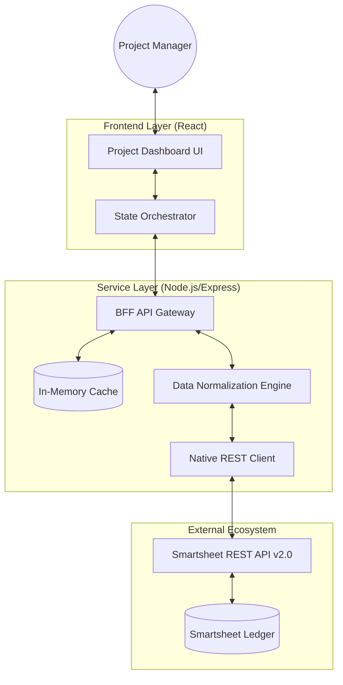

# High-Level Design (HLD) - Smartsheet Project Dashboard

## 1. System Overview
The Smartsheet Project Dashboard is a specialized full-stack application that provides an optimized, real-time interface for managing project data stored in Smartsheet. It acts as a customized "glass layer" over the Smartsheet API, offering a tailored UI/UX while ensuring all data remains centralized in Smartsheet.

## 2. Architectural Representation

## 3. Core Components

### 3.1 Frontend Orchestrator
- **Technology**: React (SPA).
- **Purpose**: Provides a high-performance grid and task management interface.
- **Key Logic**: Manages local state synchronization, keyboard shortcuts, and optimistic UI updates.

### 3.2 BFF (Backend for Frontend) Proxy
- **Technology**: Node.js / Express.
- **Purpose**: Acts as an intermediary to handle authentication, CORS, and complex data mapping.
- **Caching Strategy**: Implements an in-memory caching layer to prevent excessive Smartsheet API calls and ensure snappy UI response times.

### 3.3 Data Transformation Engine
- **Purpose**: Normalizes Smartsheet’s nested cell/row structure into a flat, developer-friendly JSON format.
- **Context**: Handles complex objects like `MULTI_CONTACT` and `ABSTRACT_DATETIME` to simplify frontend consumption.

## 4. Design Principles
- **Stateless Backend**: The server does not maintain a local database; Smartsheet remains the single source of truth (SSOT).
- **Security**: Smartsheet API tokens are managed via server-side environment variables, never exposed to the client.
- **Resilience**: The system is designed to handle API rate limits and network fluctuations gracefully through error wrapping and caching.

## 5. Deployment Strategy
- **Client**: Hosted on Netlify as a static build.
- **Server**: Hosted on Render as a managed Node.js service.
- **Environment**: Distributed configuration via `.env` for secrets and service endpoints.
