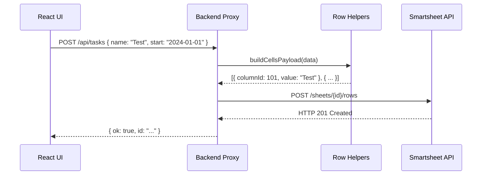

# Low-Level Design (LLD) - Smartsheet Project Dashboard

## 1. Component Specifications

### 1.1 Backend Service Client (`server/smartsheet.js`)
- **Pattern**: Factory Function providing a specialized REST wrapper.
- **Implementation**: Uses native `fetch` (Node 18+) to execute HTTP/1.1 calls against `api.smartsheet.com/2.0`.
- **Key Methods**:
    - `getSheet(id)`: Fetches full sheet object with `include=objectValue`.
    - `addRows`, `updateRows`, `deleteRows`: Performs bulk operations.

### 1.2 Data Normalization Logic (`server/utils/rowHelpers.js`)
- **`flattenRow`**: Iterates through Smartsheet's `cells` array and maps them to a key-value object using the column `title`.
- **`buildCellsPayload`**: Reverse-maps the frontend's object structure back into Smartsheet’s `columnId`/`value` format, handling specialized types like `MULTI_CONTACT`.

### 1.3 State Orchestration (`client/src/App.js`)
- **Hooks**: `useEffect` for data hydration, `useMemo` for derived stats (e.g., Phase child counts, search results).
- **Communication Layer**: Interacts with `api.real.js` which provides an abstraction over the BFF endpoints.

## 2. API Schema (BFF Layer)

| Endpoint | Method | Description |
| :--- | :--- | :--- |
| `/api/meta` | GET | Retrieves column schema, sheet ID, and project phases. |
| `/api/tasks` | GET | Returns flattened list of all tasks/rows. |
| `/api/tasks` | POST | Appends a new task under a specific parent ID (Phase). |
| `/api/tasks/:id` | PATCH | Partially updates a task's cell values. |
| `/api/tasks/:id` | DELETE | Removes a task from the ledger. |
| `/api/contacts` | GET | Returns available project team members. |

## 3. Data Transformation Flow

## 4. Key Logic Implementations

### 4.1 Column Resolution
The system resolves Smartsheet columns by building a case-insensitive `Map` during the `ensureSheetBoot` process. This allows for stable property access even if the sheet schema is slightly modified by end-users in the Smartsheet app.

### 4.2 Contact Management
The `ContactMultiSelect` component handles Smartsheet's `MULTI_CONTACT` object type.
- **Frontend**: Stores an array of emails.
- **Backend Transformation**: Encapsulates emails into `objectValue: { objectType: 'CONTACT', email: "..." }`.

### 4.3 Error Boundary & Graceful Degradation
- **REST Failures**: All Smartsheet API errors are caught, logged, and re-thrown as user-friendly messages.
- **Metadata Fallbacks**: If certain Smartsheet metadata is missing, the system falls back to default "Primary" column detection logic.

## 5. Security Protocols
- **CORS Restricted**: Allowed origins are white-listed via the `ALLOWED_ORIGINS` environment variable.
- **Token Encapsulation**: The Smartsheet API token is injected at the server level; the client never receives or stores the API key.
